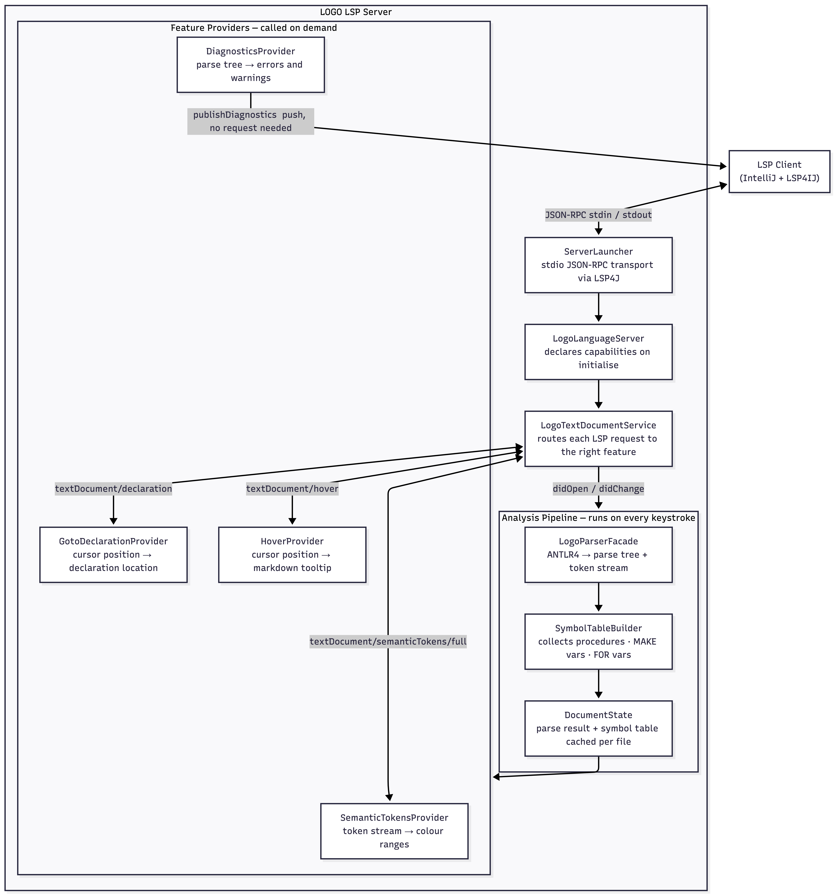

# LOGO LSP Server

A [Language Server Protocol](https://microsoft.github.io/language-server-protocol/) server for the [LOGO programming language](https://turtleacademy.com/), written in Java.

## Features

| Feature | What it does                                                                                                                                                                                                                                        |
|---|-----------------------------------------------------------------------------------------------------------------------------------------------------------------------------------------------------------------------------------------------------|
| **Syntax highlighting** | Colours keywords, built-in commands, procedure names, variables, numbers, strings, and comments                                                                                                                                                     |
| **Go-to-declaration** | Click on a procedure call, `:variable`, or `:param` jumps to where it was defined                                                                                                                                                                   |
| **Hover** | Hover over any keyword or procedure to see its signature and a short description                                                                                                                                                                    |
| **Diagnostics** | Red/yellow underlines for syntax errors, wrong argument counts, and undefined variables. Note: This is very limited just to show the feature. It would generate lot of false positives for real large logo code like in `example/qr_generator.logo` |

## How to Build and Run the Server

### Prerequisites
- **Java 17** or newer (`java -version` to check)
- **Gradle**: the project includes a Gradle wrapper, so no separate installation is required.

### Build
Run the following command to compile the server and bundle it into a single fat JAR:

```bash
./gradlew shadowJar
```

This produces a self-contained executable JAR at: `build/libs/logo-lsp-server-1.0-SNAPSHOT.jar`.

### Run Tests
To verify the core parser, symbol table construction, and feature logic without an editor:

```bash
./gradlew test
```

---

## How to Connect to an LSP Client

You can use any generic LSP client. The easiest way to test this is using IntelliJ IDEA with the free **LSP4IJ** plugin.

### Step 1: Install LSP4IJ
1. In IntelliJ IDEA, go to **Settings → Plugins → Marketplace**.
2. Search for **LSP4IJ**, install it, and restart your IDE.

### Step 2: Register the Server
1. Go to **Settings → Languages & Frameworks → Language Servers** and click **+ (Add)**.
2. Fill in the details:
    - **Name:** `LOGO LSP Server`
    - **Command:** `java -jar /absolute/path/to/logo-lsp-server-1.0-SNAPSHOT.jar` *(make sure to provide the full absolute path to the jar built in the previous step)*.
3. Switch to the **Mappings** tab and add a new mapping:
    - **File pattern:** `*.logo`
    - **Language:** `Plain Text`
4. Click **OK**.

### Step 3: Test It
Open any `.logo` file (like `examples/sample.logo`). IntelliJ will automatically launch the server. You will immediately see syntax highlighting, and you can test features like hovering over keywords or using **Ctrl+B** (or **Cmd+B**) to jump to variable definitions.

---

## Explanation of Architecture and Project Layout

### Project Layout

```
logo-lsp-server/
│
├── src/main/antlr/jetbrains/lsp/logo/parser/
│   └── Logo.g4                     ← LOGO grammar (ANTLR4)
│
├── src/main/java/jetbrains/lsp/logo/
│   ├── ServerLauncher.java          ← main() — wires stdio transport
│   ├── LogoLanguageServer.java      ← declares LSP capabilities
│   ├── LogoTextDocumentService.java ← routes LSP requests to feature providers
│   ├── LogoWorkspaceService.java    ← workspace stub (required by LSP protocol)
│   │
│   ├── parser/
│   │   ├── LogoParserFacade.java    ← parses source text → parse tree + token stream
│   │   ├── LogoParseResult.java     ← wraps ANTLR output (tree, tokens, syntax errors)
│   │   └── PositionConverter.java  ← converts ANTLR positions → LSP positions
│   │
│   ├── analysis/
│   │   ├── SymbolTableBuilder.java  ← visits parse tree → builds symbol table
│   │   ├── SymbolTable.java         ← stores procedures, MAKE vars, FOR loop vars
│   │   └── ProcedureSymbol.java     ← a single TO ... END definition
│   │
│   ├── store/
│   │   ├── DocumentStore.java       ← keeps one DocumentState per open file
│   │   └── DocumentState.java       ← parse result + symbol table for one file
│   │
│   └── feature/
│       ├── SemanticTokensProvider.java  ← token stream → colour data
│       ├── GotoDeclarationProvider.java ← cursor position → declaration location
│       ├── DiagnosticsProvider.java     ← parse tree → error/warning list
│       └── HoverProvider.java           ← cursor position → tooltip markdown
│
├── src/main/resources/
│   └── logback.xml                  ← routes all logs to stderr
│
├── src/test/java/jetbrains/lsp/logo/
│   ├── parser/LogoParserFacadeTest.java
│   ├── analysis/SymbolTableBuilderTest.java
│   └── feature/
│       ├── DiagnosticsProviderTest.java
│       ├── GotoDeclarationProviderTest.java
│       └── SemanticTokensProviderTest.java
│
└── examples/
    └── sample.logo                  ← exercises all language features
```

### Architecture Overview

The server is split into four layers. Each layer has one job and passes its result down to the next.



**Layer 1: Transport.** `ServerLauncher` starts an LSP4J launcher that reads JSON-RPC messages from `stdin` and writes responses to `stdout`. All logging goes to `stderr` so it never corrupts the protocol stream.

**Layer 2: Routing.** `LogoLanguageServer` responds to `initialize` and advertises which features the server supports. Every document notification (`didOpen`, `didChange`) and request (`semanticTokens`, `declaration`, `hover`) is handled by `LogoTextDocumentService`, which delegates to the right provider.

**Layer 3: Analysis pipeline.** On every document change the full text is re-parsed by `LogoParserFacade` (ANTLR4). The resulting parse tree is immediately walked by `SymbolTableBuilder` to collect all procedure definitions, MAKE variables, and FOR loop variables. Both outputs are stored together in a `DocumentState` and cached in `DocumentStore`. Diagnostics are published to the client as a push notification at the end of this step.

**Layer 4: Feature providers.** The four providers each read from `DocumentState` when the client asks. `SemanticTokensProvider` walks the raw token stream for syntax highlighting. The other three providers combine the token stream with the symbol table to resolve positions.

### How the layers connect
```
User edits a .logo file
        │
        ▼
LogoTextDocumentService.didChange()
        │  calls
        ▼
DocumentStore.update()
    ├── LogoParserFacade.parse()       → LogoParseResult (tree + tokens)
    └── SymbolTableBuilder.build()     → SymbolTable
        │
        ▼  results stored in DocumentState
        │
        ├──► DiagnosticsProvider  → publishDiagnostics() to client (push)
        │
        │  on client request:
        ├──► SemanticTokensProvider → SemanticTokens response
        ├──► GotoDeclarationProvider → Location response
        └──► HoverProvider          → Hover response
```

---
